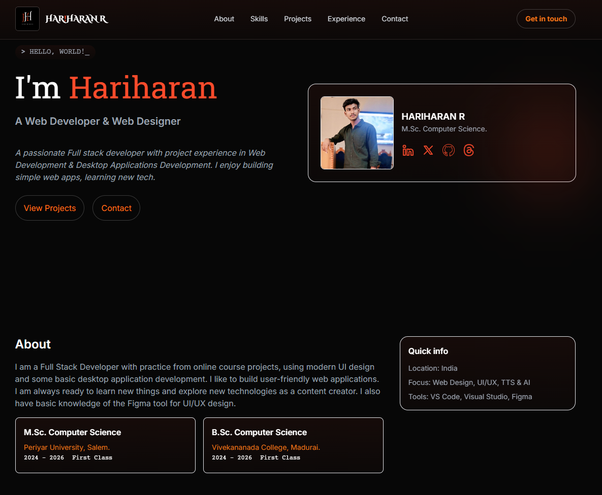

# 🌐 My Portfolio Website

This is my personal portfolio website built using **HTML, Tailwind CSS, and JavaScript**.  
It showcases my skills, projects, and contact information.  

## 🚀 Live Demo
👉 [View My Portfolio](https://rvhariharan.github.io/MY_Site/)  

## 📂 Features
- Responsive design for desktop and mobile 📱💻  
- Smooth navigation and modern UI ✨  
- Sections: Home, About, Skills, Projects, Experience, Contact  

## 🛠️ Technologies Used
- HTML5  
- CSS3 (with Tailwind)  
- JavaScript  

## 📸 Preview
 

## 📬 Contact
- Email: rvhariharan2004@gmail.com  
- LinkedIn: [LinkedIn](https://www.linkedin.com/in/hariharan-r-5812a02a5?utm_source=share&utm_campaign=share_via&utm_content=profile&utm_medium=android_app)  

---
